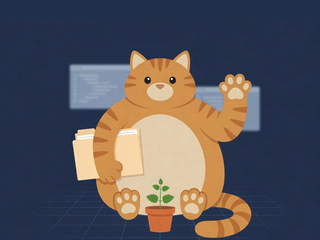
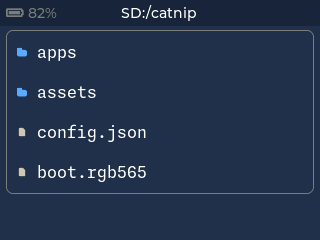
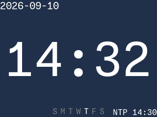
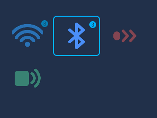
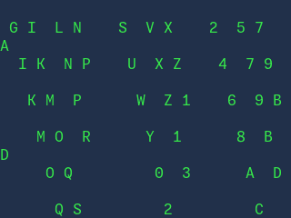

# Catnip

> Your meowkit solution.

**Languages:** English · [繁體中文](README.zh-TW.md)

Catnip turns the [MeowKit](https://www.kickstarter.com/projects/whitecliff/meowkit-versatile-device-for-makers)
— an ESP32-S3 handheld for makers — into a **Lua app platform**. A C++ runtime on the
device loads Lua apps straight from the SD card, and each app writes both its **UI** and its
**logic** in Lua. Anyone can install an app by dropping a folder onto the card — no reflash,
no toolchain.

It is the "Lua plugin system" the MeowKit was imagined to have, built for real.

## Why

The stock firmware compiles every app into the binary in C++. Adding one means forking the
firmware and reflashing. Catnip flips that: the device carries a stable runtime, and apps
live as portable Lua folders on the SD card. Write once, copy anywhere, run on any Catnip
device.

## How it works

Catnip owns the whole on-device experience and exposes a small, stable API surface to Lua:

```txt
┌──────────────────────────────────────────────────┐
│  Lua apps on SD:  /catnip/apps/<name>/           │ ← anyone writes this
├──────────────────────────────────────────────────┤
│  Built-in apps:   firmware/apps/<name>/          │ ← ships with catnip
├──────────────────────────────────────────────────┤
│  Catnip Lua API:   ui.*   device.*   service.*   │ ← the stable contract
├──────────────────────────────────────────────────┤
│  Lua 5.4 VM  (PSRAM heap, cooperative, guarded)  │
├──────────────────────────────────────────────────┤
│  Catnip C++ runtime  (bridges Lua ↔ LVGL / BSP)  │
├──────────────────────────────────────────────────┤
│  MeowKit firmware:  LVGL · BSP (wifi/ir/sd/...)  │ ← existing
└──────────────────────────────────────────────────┘
```

## What a Catnip app looks like

```lua
-- /catnip/apps/ci-dashboard/main.lua
local status

function catnip.view()
  return ui.screen{
    ui.label{ text = "CI Dashboard", style = "title" },
    ui.button{ text = "Rebuild", on_click = function()
      service.http.post("http://ci/rebuild"); device.vibrate(120)
    end },
    ui.label{ id = "status", text = "…" },
  }
end

function catnip.on_open()
  status = catnip.view:get("status")
  while true do                       -- looks synchronous; yields under the hood
    status.text = service.http.get("http://ci/status").state
    sys.sleep(5000)                   -- UI keeps running while we wait
  end
end
```

An app is just a folder on the SD card:

```txt
/catnip/apps/ci-dashboard/
├── manifest.json     # id, name, version, icon, catnip_api, permissions
├── main.lua          # catnip.view() + logic
├── icon.png          # 70×70
└── assets/           # optional
```

## App call-flow

How an app runs — from launch to the cooperative loop that keeps the UI live
while it waits:

```txt
   Catnip shell
        │  launch app
        ▼
   Loader ──── read manifest.json · check catnip_api · resolve perms
        │  ok
        ▼
   Runtime ─── start Lua 5.4 VM (PSRAM, sandbox) · run main.lua
        │
        ▼
   catnip.view()  ──►  build ui.* tree  ──►  render on LVGL
        │
        ▼
   catnip.on_open()   — runs inside a coroutine
        │
        ▼
   ┌───────────────── cooperative loop ─────────────────┐
   │  service.http.get(url) / sys.sleep(ms)             │
   │        │ yield                                     │
   │        ▼                                           │
   │  runtime pumps lv_timer_handler   (UI stays live)  │
   │        │ resume  ◄── result / timer fires          │
   │        ▼                                           │
   │  update ui.* widgets  ──►  back to top of loop     │
   └────────────────────────────────────────────────────┘
        │  back / exit
        ▼
   catnip.on_close()  ──►  free VM + widgets  ──►  return to shell
```

## Home, and how your app shows up

Home is the **cat** — the mascot, the one screen every gesture can reach and
where a long press of **B** always lands. It is not a menu; the menu is a
direction away from it. The four directions each mean a different thing:

```text
                          ▲  all apps — a 3×2 grid, paged
                          │
    pinned  ◄─────────  (=^·^=)  ─────────►  pinned
                          │
                          ▼  this device — version, clock, battery, card
```

- **Up** is _yours_: every app you have, as a paged 3×2 grid of icons.
- **Down** is _the device's_: a page of facts, its operations tucked behind **A**.
- **Left / right** step the **carousel** — the apps you pin, one big at a time.
  The clock is just an app pinned here; anything you write can take its place.

A tile shows little, on purpose: an app is **a picture and, at most, a number** —
never a caption, never a second line.

```text
  ┌──────── Apps ─────── 1/2 ──┐
  │   ▦        ▦        ▦ ³     │   a cell is an icon; the only
  │  Files    Clock    Scan     │   number it carries is a badge
  │                             │   (Scan's ³). the focused cell's
  │   ▦        ▦                 │   name is the header title; empty
  │  Rain     Notes             │   cells just aren't there yet
  └─────────────────────────────┘
```

| Where                | An app may show                                     | Set by                          |
| -------------------- | --------------------------------------------------- | ------------------------------- |
| Carousel (pinned)    | its `icon`, big, with its name in the header        | `manifest.icon`                 |
| Grid cell (all apps) | its `icon`, plus a corner **badge** — one count     | `manifest.icon` · `badge` (Lua) |
| While open           | a **counter** in the header (`2/3`), if it's a list | `manifest.counter`              |

A **badge** is a number and a number cannot grow into a sentence: `badge = 3` is
a small disc on the cell's corner. **Absent is not zero** — a cell with no badge
has not been counted yet, while a cell showing `0` was counted and came to
nothing. A missing `icon` falls back to a neutral **placeholder** glyph — not the
mascot, which means _home_ and may not also mean _some app_ — and the grid
**packs from the top left**, so the first app is always the top-left cell whether
the page holds four or six.

## The apps it ships with

Four apps are built into the firmware, so a MeowKit with an empty slot still
does something. They are **ordinary Lua apps** — the same `ui.*`, the same
`manifest.json`, no private API and no privileges — which is the point: if a
built-in needed something your app cannot have, the platform would be lying
about what it offers. They are listed first and the card's apps after, so the
ones that are always there keep their place when the card is pulled.

(A card app is _meant_ to shadow a built-in of the same `id` — the card should
win. That rule is not written yet: today both are listed. See
[#51](https://github.com/cmj0121/catnip/issues/51).)

Home is where they are all reached from, and home is the cat:



Every screen below is the **real renderer's own output** — the same LVGL backend
the device runs, drawn by the host layout tests and written out with
`CATNIP_SHOTS=<dir> .build/native/test_layout`. They are pictures of the code in
this repo rather than mockups, and regenerating them is a build rather than a
photograph.

### File Browser



The card, as rows you can walk. A row is an icon and a name; the **path lives in
the header**, because a column of names is the one shape that cannot say where
it is. **A** opens a folder or views a file, **B** goes up, and long **A** offers
the actions the manifest declares for that row — deleting asks first, and the
question names the file.

It is the app `fs.*` was built for, and the one that proves a card app and a
built-in are the same kind of thing. `Reset card` is declared but not yet wired:
`fs.reset()` answers _not available_ until the format lands ([#46](https://github.com/cmj0121/catnip/issues/46)).

### Clock



The date in the corner, the time as large as the panel allows, the weekday as
seven letters with today's picked out — and, at the foot, **where that time came
from**: `NTP` and when it last synced, or nothing if the only thing that has ever
set this clock is a thumb. A clock that cannot tell you which of those it is
will eventually be believed when it should not be.

It draws `frame: "bare"` and declares `glance: "time"`, which is why the
carousel can show its face without opening it. Setting the time by hand is
behind **A**. An unset clock shows `--:--` and never a plausible lie.

### Scanner



What is nearby, on every radio this board has. A cell per protocol with a
**count on its corner**, the bright one being whichever radio is listening right
now — one at a time, because the 2.4 GHz front end is shared and two sweeps at
once are two slow sweeps. **A** opens that protocol's list, strongest first.

**WiFi and BLE are live. IR and NFC are drawn greyed rather than hidden**: "this
board cannot hear it" and "nothing is out there" are different answers, and a
grid showing only what works cannot tell them apart. A count that is _absent_ has
not been looked for; a count of `0` was looked for and found nothing.

Launching the app for a source it found is the half that is not built yet
([#57](https://github.com/cmj0121/catnip/issues/57),
[#50](https://github.com/cmj0121/catnip/issues/50)) — the Scanner reports, it
does not yet hand over.

### Matrix Rain



Glyphs falling down a bare panel, and **nothing to press**. It earns its place by
being the shape none of the others are: the first app that redraws on its own
clock instead of waiting for a key, and the first to need `color` — because here
the colour _is_ the content, not a role the platform picks.

If a frame loop is awkward for an app to write, that is the platform's problem
to fix, and this is where it shows up first.

## Making it yours

The boot experience is set by a file on the SD card, not by rebuilding the
firmware. None of it is required: with no card, no file, or a file with a
mistake in it, the device boots and looks exactly as it shipped, and says what
it made of the file in the serial log.

```txt
/sd/catnip/
├── config.json       # the settings below
├── boot/             # optional: your own boot animation
│   ├── frame00.jpg
│   ├── frame01.jpg
│   └── frame02.jpg
└── apps/             # your Lua apps
```

```json
{
  "led": { "brightness": 8, "breaths_per_second": 0.4 },
  "boot": { "frames": "/sd/catnip/boot", "frame_ms": 400 }
}
```

| Setting                  | Means                                                                                            | Default  |
| ------------------------ | ------------------------------------------------------------------------------------------------ | -------- |
| `led.brightness`         | Peak of the LED's breath, 0-255. A WS2812 is brighter than people expect, hence the low default. | `8`      |
| `led.breaths_per_second` | How often it breathes. `0.4` is one breath every two and a half seconds.                         | `0.4`    |
| `boot.frames`            | Frames to play, in filename order. `.jpg`, `.png` and `.qoi` work. Omit for the built-in mascot. | built-in |
| `boot.frame_ms`          | How long each frame is shown.                                                                    | `400`    |

Frames are 320x240 and are decoded once at boot into PSRAM, so playing them
costs nothing afterwards; sixteen of them is the limit. A value outside its
sensible range is clamped rather than refused, and one bad line costs you that
line rather than the whole file.

## Buttons

| Press        | Does                                                                                                                           |
| ------------ | ------------------------------------------------------------------------------------------------------------------------------ |
| Power, short | Turns the screen off and on. The LED keeps breathing, dimmed to a glimmer, so a dark screen is still visibly a running device. |
| Power, held  | Switches the device off.                                                                                                       |

## Status

Early design. Catnip is an independent firmware distribution layered on the open-source
MeowKit firmware; see the [issues](https://github.com/cmj0121/catnip/issues) for the
current plan.

## DDD (Dream-Driven Development)

Features are driven by what the author dreams of and needs — nothing more.
